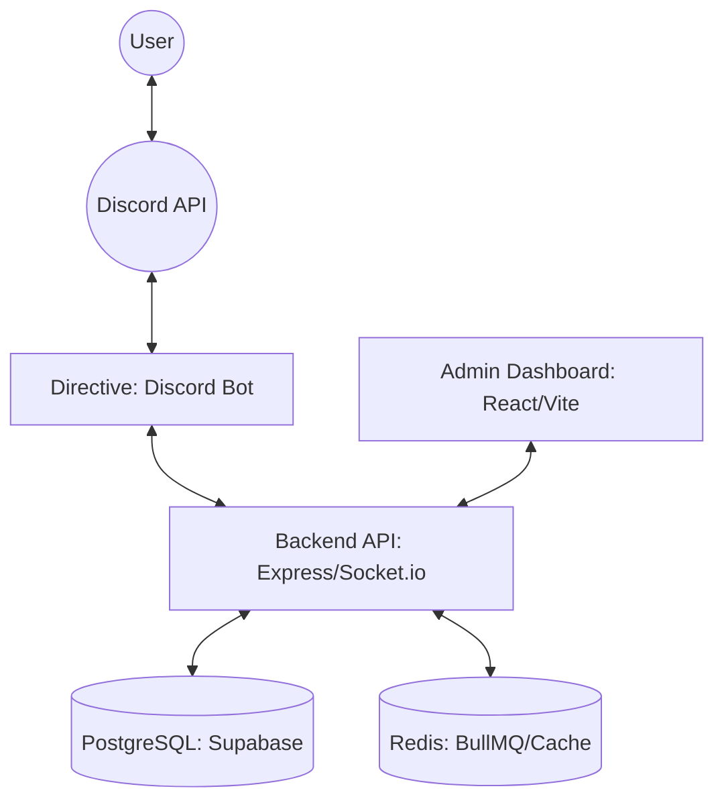

# System Architecture

The Discord Counselor System is designed with an enterprise-ready architecture, separating concerns across different services.

## Overview

## Components

### 1. Directive (Bot)
- Built with `Discord.js`.
- Handles Slash Commands and Events.
- Connects to Backend for data and BullMQ for background jobs.

### 2. Backend API
- Built with `Express.js`.
- Uses `Prisma ORM` for database interactions.
- Provides real-time updates via `Socket.io`.
- Manages queues with `BullMQ`.

### 3. Frontend Dashboard
- Built with `React` and `Vite`.
- Provides an interface for administrators to manage the bot and view logs.

## Data Flow
1. User interacts with the bot on Discord.
2. The Bot processes the command and sends data to the Backend.
3. The Backend updates the database and emits real-time events to the Dashboard.
4. Background tasks (like long-running reports) are handled by BullMQ workers.
